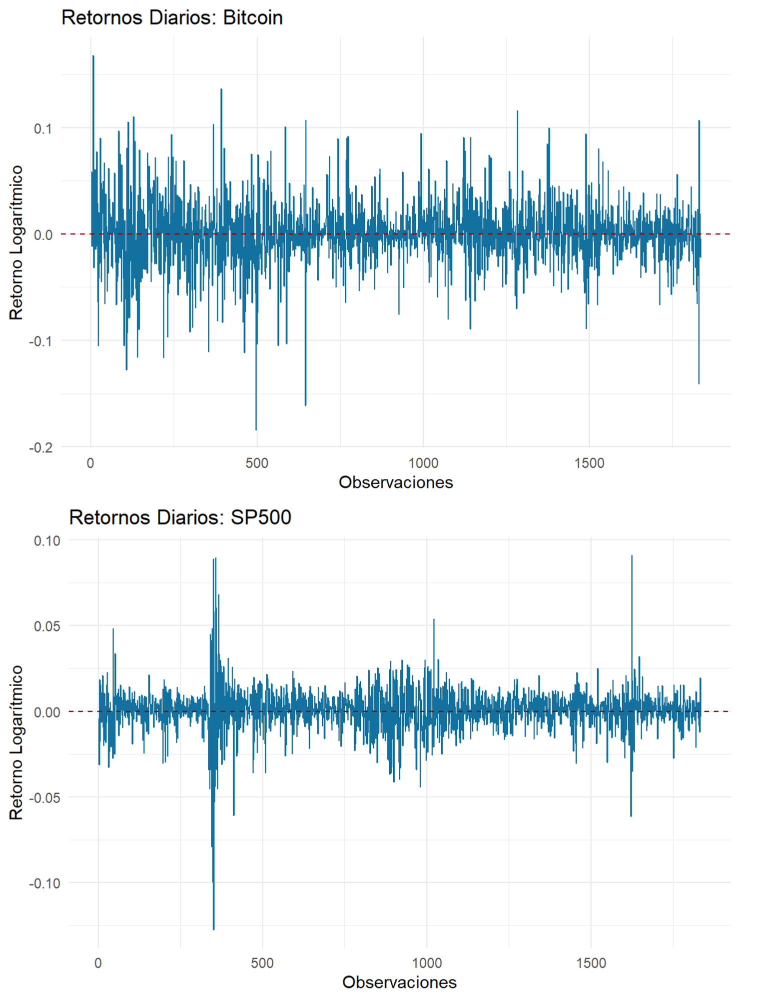
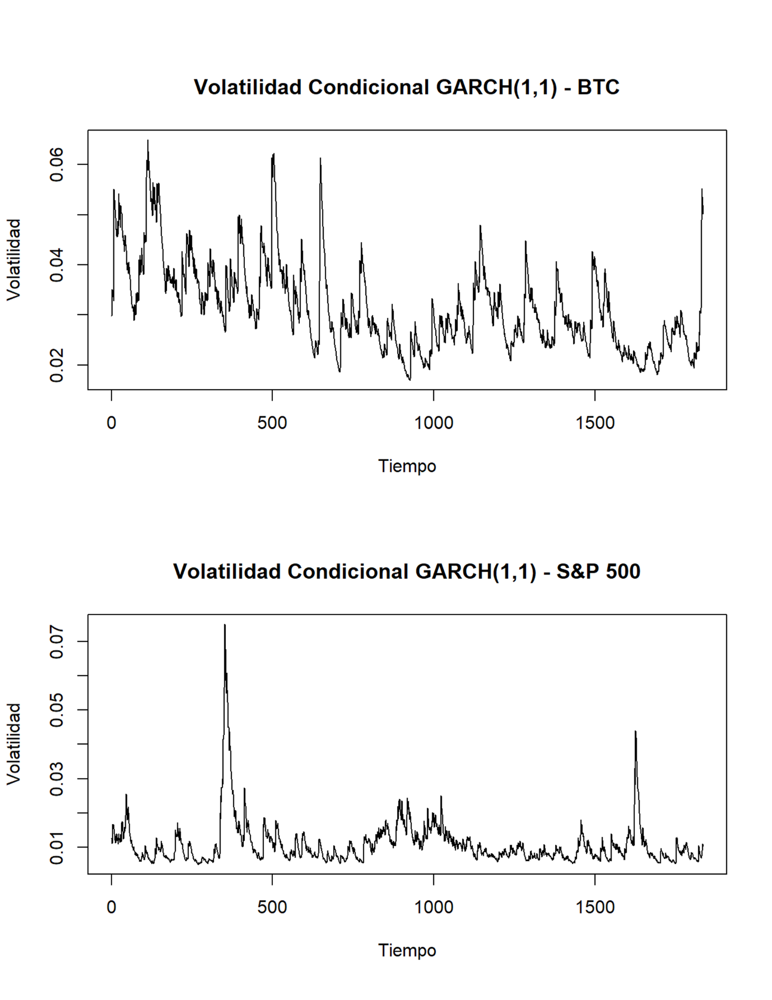
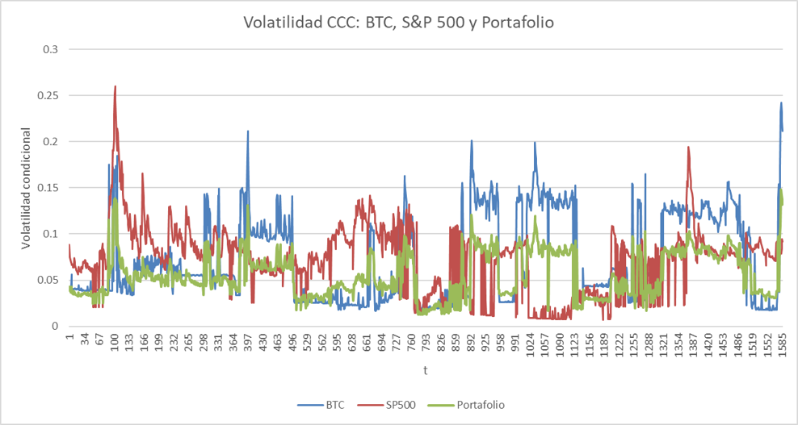

# Volatility Modeling: Bitcoin vs S&P 500

Comparative analysis of conditional volatility dynamics for Bitcoin and 
the S&P 500 using daily log returns over a 5-year period.

## Methodology
- Log return calculation and descriptive statistics
- Normality testing (Jarque-Bera) and autocorrelation analysis (Ljung-Box)
- ARCH effects detection (ARCH-LM test)
- Volatility estimation: Historical (250-day rolling window), EWMA (λ=0.94),
  ARCH, GARCH(1,1), and GJR-GARCH(1,1)
- Portfolio volatility via Constant Conditional Correlation (CCC) model
  (60% BTC / 40% S&P 500)

## Key Results

### Return Series


### Volatility Comparison


### CCC Portfolio Volatility


### Summary Table
| Model          | BTC (avg) | S&P 500 (avg) | BTC (1-day) | S&P 500 (1-day) |
|----------------|-----------|---------------|-------------|-----------------|
| Historical     | 2.8181%   | 1.2154%       | 2.2389%     | 1.1704%         |
| EWMA           | 2.6208%   | 1.1008%       | 4.4662%     | 0.7920%         |
| ARCH           | 3.2280%   | 1.0959%       | 4.0900%     | 1.1451%         |
| GARCH(1,1)     | 3.1468%   | 1.0913%       | 4.8880%     | 0.9668%         |
| GJR-GARCH(1,1) | 3.1673%   | 1.0869%       | 5.2720%     | 0.8928%         |

## Main Findings
- Bitcoin exhibited ~2.3x higher daily volatility than the S&P 500
- Both series reject normality and display heavy tails and volatility 
  clustering
- GARCH(1,1) persistence: α+β ≈ 0.999 (BTC) and ≈ 0.983 (S&P 500)
- GJR-GARCH confirmed a leverage effect in the S&P 500 (γ₁ significant), 
  but not in Bitcoin
- CCC model 1-day portfolio volatility forecast: 13.15%

## Note on CCC Implementation
The rolling-window CCC uses standard GARCH(1,1) for both assets. For the 
S&P 500, the gamma coefficient from the globally-estimated GJR-GARCH is 
incorporated into each window's forecast. This is a deliberate 
simplification — a fully rolling GJR estimation would be more rigorous 
but computationally expensive.

## Requirements
```r
install.packages(c("rugarch", "fGarch", "zoo", "ggplot2", 
                   "FinTS", "fBasics", "writexl", "readxl"))
```

## Usage
Place `market_prices.xlsx` in the working directory, then run 
`volatility_btc_sp500.R`.

> Code comments are in Spanish, reflecting the academic context 
> in which this project was developed.
